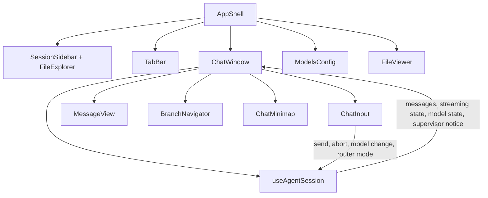
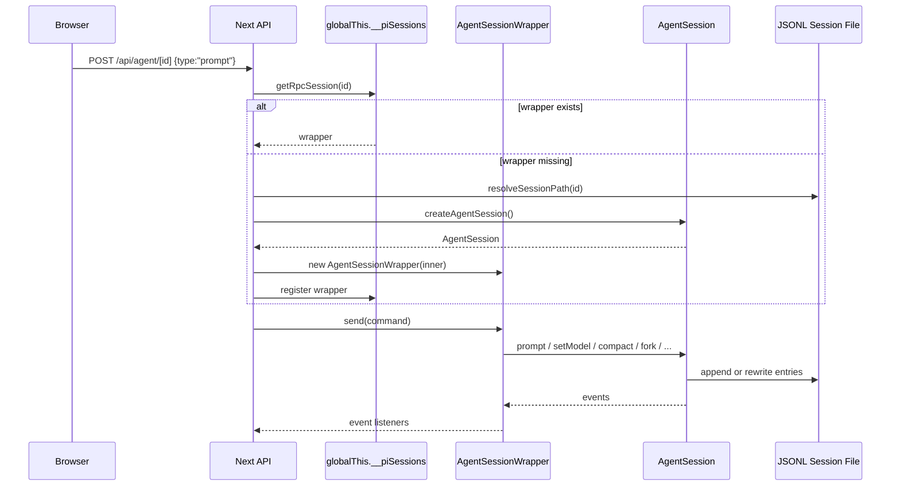
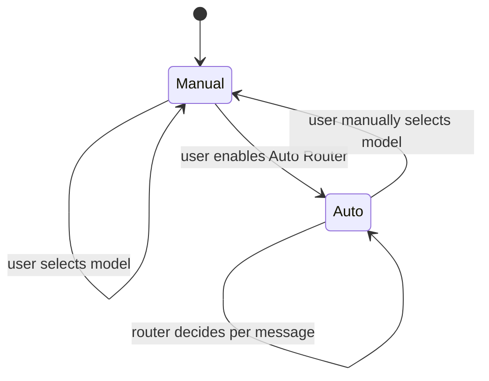
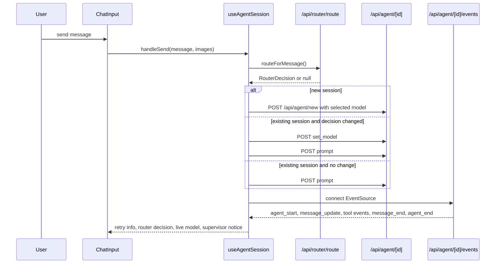
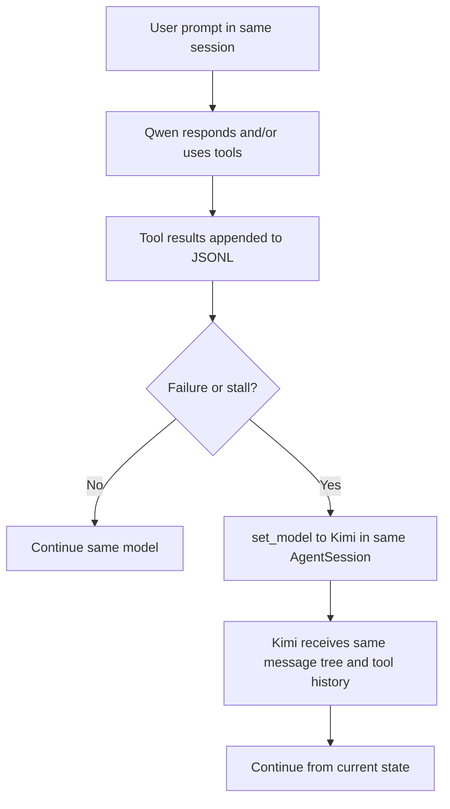
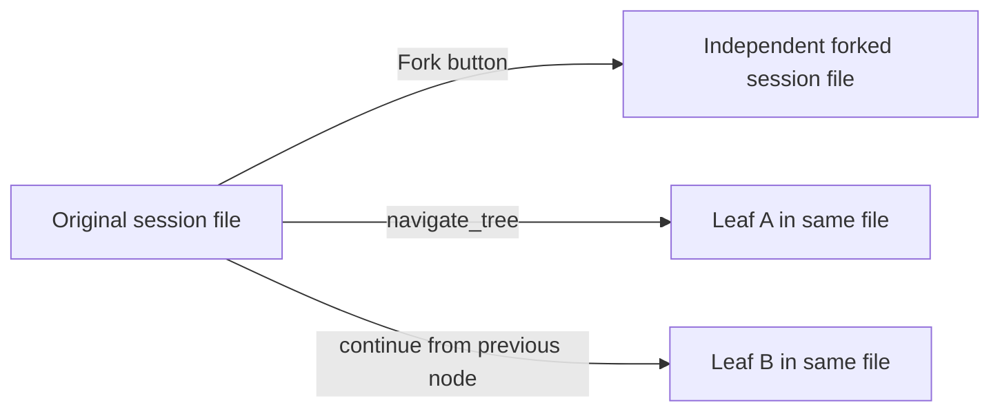

# pi-web Product Technical Architecture

## 1. Product Positioning

`pi-web` is a browser-based interface for the `pi-coding-agent` runtime. It turns local agent sessions into a visual product surface: users can browse historical sessions, continue conversations, fork from previous messages, switch in-session branches, inspect files, control tools, select models, and let an LLM router dynamically choose or upgrade models.

The current product direction is local-first but not local-only:

- Use local/free models such as Qwen for simple, standard, and cost-sensitive work.
- Use cloud/paid strong models such as Kimi for complex reasoning, long coding tasks, research/report generation, vision, and recovery after local model failure.
- Keep manual model selection strict. If the user manually selects Qwen or Kimi, the backend must not silently substitute another model.
- Keep model switching inside the same `AgentSession` whenever possible so model upgrades preserve the full session context.
- Detect objective failure and repeated state stalls to avoid infinite local-model retry loops.

## 2. Core Product Capabilities

| Capability | Product Behavior | Main Implementation |
| --- | --- | --- |
| Session browser | Lists previous pi sessions by working directory | `GET /api/sessions`, `lib/session-reader.ts`, `components/SessionSidebar.tsx` |
| Chat runtime | Sends user messages and streams assistant/tool events | `POST /api/agent/[id]`, `GET /api/agent/[id]/events`, `hooks/useAgentSession.ts` |
| New session | Creates a fresh `AgentSession` with cwd, model, tools, and prompt | `POST /api/agent/new` |
| Manual model switch | User-selected model is applied exactly and Auto Router is disabled | `handleModelChange()`, `set_model` command |
| Auto model routing | Router chooses model per message based on profile and task complexity | `POST /api/router/route`, `lib/llm-router.ts` |
| Model upgrade | Local/free model can upgrade to strong/cloud model after failure or stall | `upgradeModelAfterFailure()` |
| Stall supervisor | Detects repeated no-progress states; upgrades or pauses for intervention | `progressSignal()`, `observeProgress()` |
| Session fork | Creates independent child session from a user message | `fork` command in `lib/rpc-manager.ts` |
| In-session branch | Navigates alternate branches inside one `.jsonl` file | `navigate_tree`, `/api/sessions/[id]/context` |
| Tool preset | Enables none/default/full tool sets | `components/ToolPanel.tsx`, `set_tools` |
| Compaction | Summarizes long sessions to fit context window | `compact`, compaction SSE events |
| File viewer | Opens files from current working directory in tabs | `app/api/files/[...path]/route.ts`, `FileExplorer`, `FileViewer` |
| Model config UI | Reads/writes local model provider configuration | `components/ModelsConfig.tsx`, `/api/models-config` |

## 3. High-Level Runtime Architecture

```mermaid
flowchart LR
  Browser[Browser UI]
  Next[Next.js Server]
  Agent[AgentSession in process]
  Files[Session JSONL files]
  Models[models.json / settings.json / router.json]
  Tools[Tools and MCP/extension tools]

  Browser -->|GET /api/sessions| Next
  Next -->|read only| Files
  Files --> Next
  Next --> Browser

  Browser -->|POST /api/router/route| Next
  Next -->|read model registry + router config| Models
  Next --> Browser

  Browser -->|POST /api/agent/new or /api/agent/[id]| Next
  Next -->|startRpcSession / send command| Agent
  Agent -->|persist messages| Files
  Agent -->|use active tools| Tools

  Browser -->|GET /api/agent/[id]/events| Next
  Agent -->|subscribe events| Next
  Next -->|SSE stream| Browser
```

Important design boundary:

- Session browsing is read-only and does not create an `AgentSession`.
- Sending messages, changing model, running tools, compaction, fork, and branch navigation require a live `AgentSessionWrapper`.

## 4. Frontend Component Architecture



Key UI state is owned by `useAgentSession`:

- Current loaded messages.
- Streaming message reducer state.
- Agent running phase: waiting model, running tools, compacting, etc.
- Current model override and live response model.
- Manual/Auto router mode and router profile.
- Last router decision.
- Retry info and supervisor notices.
- Context usage and runtime stats.

## 5. Backend API Architecture

| Route | Method | Purpose |
| --- | --- | --- |
| `/api/sessions` | `GET` | List all persisted sessions |
| `/api/sessions/[id]` | `GET` | Load a session context from JSONL |
| `/api/sessions/[id]` | `PATCH` | Rename session |
| `/api/sessions/[id]` | `DELETE` | Delete session and update child metadata |
| `/api/sessions/[id]/context?leafId=` | `GET` | Load a specific in-session branch |
| `/api/agent/new` | `POST` | Create a new live agent session and send first prompt |
| `/api/agent/[id]` | `GET` | Return whether session is running and its live state |
| `/api/agent/[id]` | `POST` | Send commands: prompt, abort, set_model, compact, fork, tools |
| `/api/agent/[id]/events` | `GET` | SSE stream for live agent events |
| `/api/models` | `GET` | Read available models and default model |
| `/api/models-config` | `GET/POST` | Read/write `~/.pi/agent/models.json` |
| `/api/models-config/test` | `POST` | Smoke-test model configuration |
| `/api/router/route` | `POST` | Return router decision for a message |
| `/api/files/[...path]` | `GET` | Read workspace file contents |
| `/api/skills/*` | various | Skill search/install/list endpoints |

## 6. AgentSession Lifecycle

`lib/rpc-manager.ts` wraps the SDK `AgentSession` in `AgentSessionWrapper`.



Lifecycle rules:

- One wrapper per live session id is stored in `globalThis.__piSessions`.
- `globalThis` is used because Next.js hot reload can recreate module-level state.
- Wrappers have an idle timeout of 10 minutes.
- Concurrent session starts share `globalThis.__piStartLocks` to avoid duplicate wrappers.
- `fork` destroys the wrapper immediately because the SDK mutates the inner session id in-place during fork.

## 7. Session Persistence and Context Model

Pi session files are JSONL files under:

```text
~/.pi/agent/sessions/<encoded-cwd>/<timestamp>_<uuid>.jsonl
```

Typical entries:

```jsonl
{"type":"session","version":3,"id":"<uuid>","timestamp":"...","cwd":"/path","parentSession":"/abs/path/to/parent.jsonl"}
{"type":"model_change","id":"<entry>","parentId":null,"provider":"local-qwen","modelId":"Qwen/Qwen3.6-35B-A3B","timestamp":"..."}
{"type":"message","id":"<entry>","parentId":"<entry>","message":{"role":"user","content":"..."}}
{"type":"message","id":"<entry>","parentId":"<entry>","message":{"role":"assistant","content":[...],"provider":"local-qwen","model":"Qwen/Qwen3.6-35B-A3B"}}
{"type":"message","id":"<entry>","parentId":"<entry>","message":{"role":"toolResult","toolCallId":"...","content":[...]}}
{"type":"compaction","id":"<entry>","parentId":"<entry>","summary":"...","firstKeptEntryId":"<entry>","tokensBefore":123456}
{"type":"session_info","id":"...","parentId":"...","name":"user-defined name"}
```

Context consistency depends on this model:

- Model changes are session entries/state changes, not new conversations.
- If Qwen upgrades to Kimi through `set_model` inside the same live session, the SDK continues from the same message tree and tool history.
- Tool results remain in the session context visible to the next model.
- Forking creates a new session file, so fork is a different context lineage.
- In-session branch navigation changes the active leaf inside the same file and uses `entryIds[]` to map UI messages to session entries.

## 8. LLM Router Technical Design

The router lives in `lib/llm-router.ts` and is exposed through `POST /api/router/route`.

### 8.1 Router Inputs

```ts
interface RouterRequest {
  cwd: string;
  message: string;
  hasImages?: boolean;
  currentModel?: { provider: string; modelId: string } | null;
  profile?: string;
  availableModels: RouterModel[];
  contextTokens?: number | null;
}
```

`availableModels` comes from `services.modelRegistry.getAvailable()` plus provider metadata read from `~/.pi/agent/models.json`, especially `api` and `baseUrl`.

### 8.2 Router Decision

```ts
interface RouterDecision {
  provider: string;
  modelId: string;
  tier: "simple" | "standard" | "complex" | "reasoning" | "vision";
  profile: string;
  reason: string;
  confidence: number;
  matchedSignals: string[];
  changed: boolean;
  fallback: boolean;
  costClass: "free" | "paid" | "unknown";
  deployment: "local" | "cloud" | "unknown";
  capability: "basic" | "standard" | "strong" | "vision";
  upgradeModel?: {
    provider: string;
    modelId: string;
    costClass: "free" | "paid" | "unknown";
    deployment: "local" | "cloud" | "unknown";
    capability: "basic" | "standard" | "strong" | "vision";
    reason: string;
  };
}
```

### 8.3 Router Profiles

| Profile | Policy | Intended Behavior |
| --- | --- | --- |
| `cost-saver` | `local-first` | Prefer local/free. Keep paid cloud as upgrade path after objective failure. |
| `balanced` | `balanced` | Local for simple/standard; cloud strong for complex, reasoning, vision. |
| `best-quality` | `quality-first` | Prefer strongest cloud/paid model except very simple tasks. |

### 8.4 Task Classification

The router classifies each user message into a tier:

- `simple`: short explanation, translation, summary, quick question.
- `standard`: normal coding or medium-length instruction.
- `complex`: multi-file coding, long prompt, research plus deliverable, webpage/audio/video/PPT style generation.
- `reasoning`: explicit deep reasoning, architecture, migration, algorithm, proof, trade-off analysis.
- `vision`: image input or vision/multimodal requirement.

Signals currently include:

- Prompt length and line count.
- Context token usage.
- Coding markers: refactor, debug, test, TypeScript, API, database, implementation.
- Reasoning markers: architecture, migration, invariant, optimization, trade-offs.
- Research markers: news, report, sources, latest, recent days.
- Production markers: webpage, animation, audio, voiceover, PPT, TikTok/Douyin, synchronized timeline.
- Delivery markers: implement, build, create, full, end-to-end.

### 8.5 Model Identity and Renaming Support

Provider names and display names are user-editable. Therefore the router must not rely on fixed provider names like `new-provider-1`.

Stable identity rules:

- Primary identity is `provider + modelId`.
- Fallback matching can use `modelId` when exactly one provider exposes that id.
- Display name `model.name` is only for UI and optional user convenience.
- Metadata lookup order is:
  1. `provider:modelId`
  2. `modelId`
  3. `model.name`

This supports user-renamed providers such as:

- `local-qwen`
- `cloud-kimi`

It also supports later model display-name changes without breaking route decisions.

### 8.6 Dynamic Local/Cloud Inference

When `router.json` does not explicitly define metadata, the router infers:

- Local/private `baseUrl`: `localhost`, `127.*`, `10.*`, `192.168.*`, `172.16-31.*`, `*.local`.
- Cloud/paid: public `https://` base URL or known cloud provider keywords.
- Qwen/local models usually become `local/free/standard`.
- Kimi, Claude, GPT, Opus, Sonnet, DeepSeek, O-series, and similar models usually become `cloud/paid/strong`.
- Image-capable models become `vision`.

## 9. Manual vs Auto Model Contract



Manual mode contract:

- The model dropdown is authoritative.
- Selecting a model sets `routerMode = "manual"`.
- `lastRouterDecision` is cleared.
- The UI highlights Manual and the selected model.
- No automatic route decision is applied before sending messages.
- If the user chooses Qwen, the prompt must go to Qwen unless the user changes mode.

Auto mode contract:

- The model dropdown becomes a reference display and is visually greyed.
- The router mode/profile UI is highlighted.
- A route decision is computed before each new user message.
- If `decision.changed` is true, `set_model` runs before `prompt`.
- The live response model is shown immediately so the UI reflects the actual responding model.

## 10. Auto Routing and Send Flow



## 11. Failure Upgrade Strategy

The product handles two upgrade paths.

### 11.1 Router-Suggested Upgrade

For local/free selections in upgrade tiers such as `complex` and `reasoning`, the initial router decision may include `upgradeModel`.

If the completed assistant message has:

- `stopReason === "error"`
- `errorMessage`
- empty assistant content with zero usage

then `useAgentSession` can switch to the suggested upgrade model using `set_model`.

### 11.2 Recovery Reroute

If the local model emits repeated auto retry events or objective failure, `upgradeModelAfterFailure()` calls the router again with:

- The original user prompt.
- A failure preamble explaining the previous local model failed.
- `profile: "best-quality"`.
- Current context token usage.
- Current model as `currentModel`.

The recovery decision then applies `set_model` inside the same session.

This is intentionally not a new session and not a fork, so context remains consistent.

## 12. State Stall Supervisor

The supervisor is a lightweight runtime guard in `hooks/useAgentSession.ts`.

Goal:

- Detect when the agent appears active but is not making meaningful progress.
- Upgrade local/free models before they waste multiple loops.
- Pause strong-model loops and ask for human intervention when automation is no longer reliable.

### 12.1 Progress Signals

`progressSignal(message)` classifies completed assistant and tool result messages:

| Message | Signal | Examples |
| --- | --- | --- |
| Assistant error | `stall` | `stopReason: "error"`, `errorMessage: "terminated"` |
| Assistant long text | `progress` | substantial plan, explanation, generated content |
| Assistant short tool handoff | `ignore` | minimal text before a tool call |
| Tool empty output | `stall` | `(no output)` |
| Tool artifact success | `progress` | `Successfully wrote`, `created`, `updated`, `-rw`, `exit_code: 0` |
| Tool command error | `stall` | `Command exited with code 1`, `externally-managed-environment`, `Traceback`, `permission denied` |
| Tool new information | `progress` | search/list/read outputs that are not errors |

### 12.2 Stall Counters

`observeProgress()` maintains:

```ts
{
  lastFingerprint: string;
  localStalls: number;
  strongStalls: number;
}
```

Rules:

- New progress resets counters.
- Repeated stall or repeated fingerprint increments the relevant counter.
- Local/non-strong model with `localStalls >= 2` triggers `upgradeModelAfterFailure("state_stall")`.
- Strong/cloud model with `strongStalls >= 2` sends `abort` and shows a human-intervention notice.

### 12.3 Strong Model Detection

The current heuristic treats the model as strong if `provider + modelId` contains signals such as:

- `kimi`
- `cloud`
- `claude`
- `gpt`
- `opus`
- `sonnet`
- `o3`
- `o1`
- `deepseek`

This is intentionally conservative: unknown/local models are treated as candidates for upgrade, while obvious strong models are protected from infinite loops by intervention.

### 12.4 Supervisor UI

`SupervisorNotice` is displayed above the input box:

- `warning`: local model stalled and is upgrading. The notice states context remains in the same session.
- `error`: strong model also stalled; the agent is paused for human intervention.

The notice is cleared when:

- The user sends a new message.
- The user manually changes model.

## 13. Context Consistency During Model Switching



Why context remains consistent:

- `set_model` changes the active model on the existing `AgentSession`.
- The session id does not change.
- The session file does not fork.
- Prior user messages, assistant messages, tool calls, tool results, compactions, and current leaf remain part of the same context.
- The UI sets `activeResponseModel` so users can see the real model used after switching.

Important limitation:

- If a model fails while a tool command has partially modified the filesystem, the new model sees the tool result in context but must infer filesystem side effects from tool output unless it reads files again.

## 14. Model Configuration

The primary model config lives at:

```text
~/.pi/agent/models.json
```

The product exposes it through the Models modal and `/api/models-config`.

Recommended provider naming:

```json
{
  "providers": {
    "local-qwen": {
      "api": "openai-compatible",
      "baseUrl": "http://localhost:8000/v1",
      "models": [
        {
          "id": "Qwen/Qwen3.6-35B-A3B",
          "name": "Qwen Local"
        }
      ]
    },
    "cloud-kimi": {
      "api": "openai-compatible",
      "baseUrl": "https://api.moonshot.cn/v1",
      "models": [
        {
          "id": "kimi-k2.6",
          "name": "Kimi K2.6"
        }
      ]
    }
  }
}
```

The exact structure is ultimately owned by `pi-coding-agent`, but `pi-web` reads provider `api` and `baseUrl` to improve router inference.

## 15. Router Configuration

Optional router config lives at:

```text
~/.pi/agent/router.json
```

Example:

```json
{
  "version": 1,
  "enabled": true,
  "defaultProfile": "balanced",
  "models": {
    "local-qwen:Qwen/Qwen3.6-35B-A3B": {
      "costClass": "free",
      "deployment": "local",
      "capability": "standard",
      "priority": 5
    },
    "cloud-kimi:kimi-k2.6": {
      "costClass": "paid",
      "deployment": "cloud",
      "capability": "strong",
      "priority": 20
    }
  },
  "profiles": {
    "balanced": {
      "label": "Balanced",
      "policy": "balanced",
      "upgradeTiers": ["complex", "reasoning"],
      "preferences": {
        "simple": ["qwen", "local"],
        "standard": ["qwen", "local", "kimi"],
        "complex": ["kimi", "sonnet", "opus", "gpt-5"],
        "reasoning": ["kimi", "o3", "opus"],
        "vision": ["kimi", "vision", "gpt-4o"]
      }
    }
  }
}
```

If the file is missing or invalid, the app falls back to `DEFAULT_ROUTER_CONFIG`.

## 16. SSE Event Handling

The live UI connects to:

```text
GET /api/agent/[id]/events
```

Important event classes:

- `agent_start`: mark running, initialize response timing and supervisor counters.
- `message_update`: stream assistant content.
- `message_end`: finalize assistant/tool result message and run failure/stall checks.
- `agent_end`: stop running state.
- `tool_execution_start` / `tool_execution_end`: show current tool phase.
- `auto_retry_start` / `auto_retry_end`: show retry banner and trigger upgrade after repeated retries.
- `compaction_start` / `compaction_end`: show compaction status.
- `auto_compaction_start` / `auto_compaction_end`: compatibility with older pi versions.

## 17. Branching Model



Two branching concepts must stay separate:

- Fork creates a new JSONL file and appears as a child session in the sidebar.
- In-session branch keeps one JSONL file with multiple possible leaves.

`parentSession` in the session header is display metadata only. It does not affect chat context.

## 18. Tool Presets and System Prompt Behavior

Tool presets:

- `none`: no coding tools.
- `default`: default coding tools.
- `full`: full coding tools.

For new sessions, selected tool names are sent to `/api/agent/new`.

For existing sessions:

- `get_tools` reads active tools from the live `AgentSession`.
- `set_tools` updates active tools by name.
- Extension tools are preserved by `withExtensionTools()` so disabling coding tools does not accidentally remove extension-provided tools.

When tools are fully disabled, `rpc-manager.ts` injects a minimal system prompt through `system-prompt-off.ts` and `DefaultResourceLoader`.

## 19. Compaction Strategy

Compaction is used for long sessions and context-window pressure.

Manual compaction:

- User clicks compact.
- UI sends `{ type: "compact" }`.
- Button stays disabled while the blocking request is running.
- Result shows token reduction estimates.

Auto compaction:

- Managed by the SDK.
- UI accepts both newer `compaction_*` events and older `auto_compaction_*` events.

Compaction affects context by replacing older details with a summary while preserving recent entries from `firstKeptEntryId`.

## 20. Security and Secret Handling

Local configuration files can contain provider keys and must not be committed:

- `~/.pi/agent/auth.json`
- `~/.pi/agent/models.json`
- `~/.pi/agent/router.json`
- `~/.pi/agent/settings.json`
- `.env*`

Repository policy:

- Keep secrets outside the repo.
- Use `.gitignore` for local env/config files.
- Never paste API keys into README or architecture docs.
- Provider display examples in docs must use placeholders or non-secret metadata only.

File access:

- File viewer routes should remain constrained to intended workspace paths.
- Session files are read from the configured agent data directory.

## 21. Operational Notes

### Development

```bash
npm install
npm run dev
```

Per project rules, do not run `next build` during development because it can pollute `.next/` and interfere with `npm run dev`.

### Verification

Recommended checks:

```bash
node_modules/.bin/tsc --noEmit
npm run lint
```

### Linux File Watch Limits

Next.js/Turbopack uses Linux `inotify` watchers. On machines with many watched files, the OS can report that the file watch limit is reached.

Permanent mitigation:

```bash
echo fs.inotify.max_user_watches=1048576 | sudo tee /etc/sysctl.d/99-pi-web-inotify.conf
echo fs.inotify.max_user_instances=1024 | sudo tee -a /etc/sysctl.d/99-pi-web-inotify.conf
sudo sysctl --system
```

Temporary workaround:

```bash
npm run dev -- --webpack
```

## 22. Product Risks and Mitigations

| Risk | Impact | Mitigation |
| --- | --- | --- |
| Local model repeatedly terminates | Long tasks appear stuck | Auto retry and supervisor trigger model upgrade |
| Cloud model loops without progress | Cost and time waste | Strong-model stall counter aborts and asks for intervention |
| User-renamed provider breaks routing | Wrong model selected | Match by `provider:modelId`, fallback to unique `modelId` |
| Manual Qwen secretly uses Kimi | Trust failure | Manual selection disables router and sends explicit `set_model` |
| Stale model registry after editing `models.json` | `Model not found` on switch | Destroy and recreate wrapper once on stale registry error |
| UI shows old model during switch | User confusion | `activeResponseModel` displays real live response model |
| Fork corrupts parent chain | Wrong session lineage | Destroy wrapper immediately after fork |
| JSONL toolCall field mismatch | Broken render | Normalize tool calls on file load and streaming |
| Long context degrades model quality | Poor answers or failures | Context usage display and compaction |

## 23. Current Implementation File Map

```text
app/api/
  agent/new/route.ts
  agent/[id]/route.ts
  agent/[id]/events/route.ts
  router/route/route.ts
  models/route.ts
  models-config/route.ts
  models-config/test/route.ts
  sessions/route.ts
  sessions/[id]/route.ts
  sessions/[id]/context/route.ts
  files/[...path]/route.ts

components/
  AppShell.tsx
  ChatWindow.tsx
  ChatInput.tsx
  MessageView.tsx
  SessionSidebar.tsx
  BranchNavigator.tsx
  ChatMinimap.tsx
  ModelsConfig.tsx
  ToolPanel.tsx
  FileExplorer.tsx
  FileViewer.tsx
  TabBar.tsx

hooks/
  useAgentSession.ts
  useAudio.ts
  useTheme.ts
  useDragDrop.ts

lib/
  llm-router.ts
  rpc-manager.ts
  session-reader.ts
  normalize.ts
  types.ts
  pi-types.ts
  agent-client.ts
  system-prompt-off.ts
```

## 24. End-to-End Example: Complex Research Report

User request:

```text
调研最近7天内AI圈最火热的新闻，整理成网页版科技报告，包含科技感动画，
并生成可与网页动态播放时间匹配的口播音频，效果类似动态播放的PPT风格。
```

Expected route:

1. Router detects research, media/web deliverable, implementation deliverable, and complex production output.
2. In `balanced`, it should prefer strong/cloud candidates such as Kimi.
3. In `cost-saver`, it may start on Qwen but should include an upgrade candidate.
4. If Qwen hits retry 2, `terminated`, tool errors, repeated empty output, or state stall, supervisor upgrades to Kimi.
5. The upgrade happens through `set_model` in the same session.
6. Kimi sees the same prompt, partial artifacts, tool errors, and tool outputs.
7. If Kimi also loops with no progress, the supervisor aborts and shows human intervention notice.

## 25. Future Improvements

Recommended next steps:

- Add explicit supervisor configuration to `router.json`, such as local stall threshold, strong stall threshold, and allowed upgrade targets.
- Add structured event telemetry for router decisions and supervisor actions.
- Store model switch reasons as session metadata so history can explain why a model changed.
- Add an automated router test matrix for manual Qwen, manual Kimi, auto simple, auto complex, forced retry, and forced stall.
- Improve progress detection by reading structured tool call ids and filesystem artifact diffs instead of text heuristics only.
- Add a UI timeline showing model changes, retries, compaction, tool phases, and supervisor decisions.

## 26. Summary

The current `pi-web` architecture is a visual, session-oriented shell around an in-process `pi-coding-agent` runtime. Its most important product guarantees are:

- Users can inspect and continue persisted agent sessions.
- Manual model selection is strict and trustworthy.
- Auto routing chooses models dynamically based on task complexity and profile.
- Local-first execution can upgrade to cloud/strong models on objective failure.
- Model upgrades preserve context by staying inside the same session.
- Repeated stalls are supervised so the product does not silently loop forever.

This design gives `pi-web` a practical balance between cost control, local model usage, strong-model reliability, and transparent user control.
